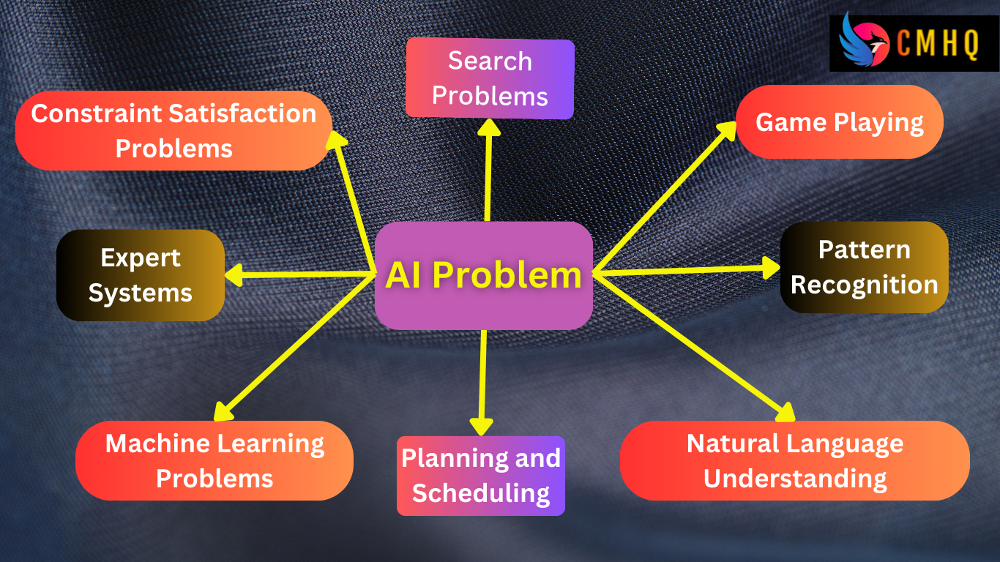

```mdx-code-block
import './style.css'
```


### 1. Artificial Intelligence

Artificial Intelligence (AI) is the field of computer science dedicated to creating computer systems that can perform tasks that would typically require human intelligence.

- **Definition:** The simulation of human intelligence in machines, enabling them to perform tasks that typically require human intelligence.
- **Example:** Creating algorithms that allow computers to recognize speech or play chess.

### 2. AI problems

In the context of Artificial Intelligence (AI), problems refer to challenges or tasks that require intelligent solutions. AI problems can be broadly categorized into various types, each presenting unique characteristics and requiring specific approaches for resolution. Here are some common types of AI problems:



1. **Search Problems:**
   - **Definition:** These problems involve finding a solution in a vast solution space.
   - **Example:** <span title="An 8-puzzle is a sliding puzzle where a 3x3 grid contains numbered tiles and one blank space. The goal is to rearrange the tiles to a specified goal state by sliding them into the blank space.">eight-puzzle</span>, <span title="Filling a 9x9 grid with digits so that each column, each row, and each of the nine 3x3 subgrids contains all of the digits from 1 to 9.">Sudoku </span>.

2. **Game Playing:**
   - **Definition:** AI systems play strategic games against human or other AI opponents.
   - **Example:** <span title="Chess is a two-player strategy board game with an 8x8 grid. The goal is to checkmate the opponent's king.">Chess</span>, <span title="Poker is a popular card game with various variants. It involves elements of skill, strategy, and bluffing.">Poker</span>.

3. **Pattern Recognition:**
   - **Definition:** Identifying patterns or trends in data.
   - **Example:** <span title="Converting handwritten text into digital text.">Handwriting recognition</span>, <span title="Identifying and verifying individuals based on their facial features.">facial recognition</span>, and <span title="Converting spoken language into written text or commands. (Virtual assistants like Siri and Alexa.)">speech recognition</span>.
4. **Natural Language Understanding:**
   - **Definition:** Comprehending and interpreting human language.
   - **Example:** <span title="Virtual assistants like Siri, Google Assistant, ChatGPT or chatbots on websites that can understand and respond to user queries in natural language.">Chatbots</span> and language translation systems.

5. **Planning and Scheduling:**
   - **Definition:** Determining a sequence of actions to achieve a specific goal.
   - **Example:** Automated scheduling systems, <span title="Planning the tasks and timeline for a construction project. This involves scheduling activities like laying the foundation, framing, electrical work, and finishing.">Project Scheduling</span>, <span title="Planning the schedule for classes in an educational institution, taking into account teacher availability, classroom availability, and student preferences.">Class Scheduling</span>.

6. **Machine Learning Problems:**
   - **Definition:** Involves training algorithms to learn patterns from data.
   - **Example:** Predictive modeling, classification, and <span title="Recognizing patterns or features in images or speech.">Image and Speech Recognition (Speech-to-text conversion)</span>.

7. **Expert Systems:**
   - **Definition:** AI systems designed to emulate the decision-making abilities of a human expert.
   - **Example:** Medical diagnosis systems ( <span title="Developed in the 1970s, MYCIN was one of the first expert systems. It was designed to diagnose bacterial infections and recommend antibiotic treatments based on patient symptoms and laboratory test results">MYCIN</span> ).

8. **Constraint Satisfaction Problems:**
   - **Definition:** Problems where a set of constraints must be satisfied to find a solution.
   - **Example:** <span title="Scheduling classes in a school or university, considering constraints such as room availability, teacher availability, and avoiding schedule conflicts for students who are enrolled in multiple courses.">Scheduling classes</span>. 

### 3. AI techniques

AI techniques refer to the methods and approaches used in the field of Artificial Intelligence to enable machines to perform tasks that normally require human intelligence.


1. **Rule-Based Systems:**
   - Rule-based systems use a set of predefined rules to make decisions. These rules are typically in the form of "if-then" statements, where specific conditions trigger certain actions.

2. **Machine Learning:**
   - Machine learning is a subset of AI that involves training algorithms to recognize patterns in data and make predictions or decisions. It includes:
     - **Supervised Learning:** The algorithm is trained on labeled data, making predictions based on input-output pairs.
     - **Unsupervised Learning:** The algorithm explores patterns in unlabeled data, finding inherent structures.
     - **Reinforcement Learning:** The algorithm learns by interacting with an environment, receiving feedback in the form of rewards or penalties.

3. **Expert Systems:**
   - Expert systems emulate the decision-making ability of a human expert in a specific domain. They use a knowledge base of facts and rules to draw conclusions and provide expert-level advice.

4. **Natural Language Processing (NLP):**
   - NLP involves the interaction between computers and human language. It enables machines to understand, interpret, and generate human-like text. Applications include chatbots, language translation, and sentiment analysis.

5. **Computer Vision:**
   - Computer vision enables machines to interpret and make decisions based on visual data. This includes tasks such as image recognition, object detection, and facial recognition.

6. **Neural Networks:**
   - Neural networks are computational models inspired by the human brain. They consist of interconnected nodes (neurons) organized in layers. Deep learning, a subset of machine learning, often involves neural networks with multiple layers (deep neural networks).

7. **Genetic Algorithms:**
   - Genetic algorithms are optimization algorithms inspired by the process of natural selection. They are used to find optimal solutions to complex problems by evolving a population of candidate solutions over multiple generations.

8. **Fuzzy Logic:**
   - Fuzzy logic deals with uncertainty and imprecision in decision-making. It allows for the representation of vague or ambiguous information, making it suitable for certain AI applications.

These techniques are often used in combination, depending on the nature of the problem and the desired outcome. Each technique has its strengths and weaknesses, and the choice of the right approach depends on the specific requirements of the AI task at hand.

### 4. Defining the problem as a State Space search 

Defining a problem as a state space search is a fundamental concept in artificial intelligence. It's a way to model problems in a structured manner that allows AI algorithms to find solutions. Here's an explanation:

**State Space:** A state space represents all possible states that a problem can be in. Each state is a configuration or arrangement of the problem's elements. For example, in a puzzle, each possible arrangement of the puzzle pieces is a state. In a navigation problem, each location of interest and the possible routes between them represent states.

**Problem Definition as State Space Search:** When defining a problem as a state space search, you break down the problem into the following components:

**1. Initial State:** This is the starting point or the state from which you begin the search. It represents the problem at the beginning.

**2. Goal State(s):** These are one or more states that represent the desired outcome or solution to the problem. The AI algorithm's objective is to find a path from the initial state to one of the goal states.

**3. Actions/Operators:** These are the possible actions that can be taken to move from one state to another. In a puzzle, an action could be moving a puzzle piece. In navigation, an action could be moving from one location to another.

**4. State Transition Model:** This defines how the application of actions changes the current state. It specifies which state you will move to when you perform a specific action from a given state.

**5. Path Cost:** If applicable, this assigns a cost to each action or state transition. It helps the algorithm find the optimal solution by minimising the total cost.

**Search Algorithms:** Once the problem is defined as a state space, you can use search algorithms to explore the state space systematically, trying to find a path from the initial state to a goal state. There are various search techniques, including BFS (Breadth-First Search), DFS (Depth-First Search), A* algorithm, and others, which you mentioned in your syllabus.

The objective of state space search is to find a sequence of actions that transforms the initial state into a goal state while adhering to the defined actions and minimising the cost if applicable. It's a powerful approach used in AI for problem-solving in various domains, from puzzle-solving to route planning and beyond.

### 5. Problem characteristics

Problem Characteristics in AI:

- **Complexity:** AI problems often deal with complex and real-world situations. These problems may have a large number of variables, states, and factors that need to be considered. The complexity of the problem affects the choice of AI techniques used to solve it.

- **Search Space:** Many AI problems can be framed as search problems. The search space represents all possible states and actions that the AI agent can explore to find a solution. The size of the search space is a critical characteristic as it impacts the efficiency of search algorithms.

- **Unpredictability:** Real-world problems often involve unpredictable elements. For example, in a game of chess, an opponent's move is uncertain. AI systems must be designed to handle this unpredictability and make decisions in uncertain environments.

- **Incomplete Information:** In many AI problems, the agent does not have complete information about the current state. There may be hidden or unknown variables. Dealing with incomplete information requires techniques such as probabilistic reasoning or fuzzy logic.

- **Multiple Solutions:** Some AI problems have multiple valid solutions. For instance, in route planning, there can be multiple paths to reach a destination. AI systems may need to find the best solution based on different criteria or constraints.

- **Dynamic Nature:** AI problems can be dynamic, meaning the state of the problem changes over time. This dynamic nature is common in robotics and game AI, where the environment and opponents' actions change continuously.

- **Interactions:** AI problems often involve interactions with other agents or elements. For example, in a game, the AI agent interacts with human players or other AI-controlled characters. Understanding and modeling these interactions is crucial for success.

- **Knowledge Representation:** The choice of how to represent knowledge about the problem is a significant characteristic. AI systems may use symbolic representations (logic and rules) or sub-symbolic representations (neural networks) depending on the problem.

- **Heuristics:** In many cases, AI problems can benefit from heuristic knowledge or rules that guide the search process. Heuristics help in making informed decisions and prioritising certain paths in the search space.

- **Optimization:** Some AI problems involve optimization, where the goal is to find the best solution among a set of possible solutions. This may require evaluating and comparing solutions based on specific criteria.

### 6. Production systems

A production system is a key concept in the field of artificial intelligence (AI) and knowledge-based systems. It is a model used to represent knowledge and control the decision-making process. Production systems consist of a set of rules and a control strategy that determines how these rules are applied to achieve a specific goal. Here's a detailed explanation of production systems:

**Components of a Production System:**

- **Condition-Action Rules (Production Rules):** Production systems are built upon condition-action rules. Each rule consists of two parts: the condition and the action. The condition specifies the circumstances under which the rule should fire, and the action defines what should be done if the condition is met.

- **Working Memory (WM):** Working memory is a data structure that holds information about the current state of the system. It contains facts and data that can be used to evaluate the conditions in the production rules.

- **Rule Interpreter (Inference Engine):** The rule interpreter is responsible for selecting and firing rules from the production system based on the current state of the working memory. It determines which rules are applicable at a given time.

- **Conflict Resolution Strategy:** In situations where multiple rules are applicable, a conflict resolution strategy is used to determine which rule should be executed. Common conflict resolution strategies include prioritisation, specificity of conditions, and recency of data.

**How Production Systems Work:**

- The production system starts with an initial state in the working memory.
- The rule interpreter examines the rules to find a rule whose conditions match the state in the working memory. When a matching rule is found, it's considered for execution.
- If there are multiple rules that match, the conflict resolution strategy is used to decide which rule to execute.
- Once a rule is selected, its action is performed, which can involve modifying the working memory or performing other actions.
- This process repeats iteratively until a predefined goal state is achieved or no more applicable rules are found.

**Advantages of Production Systems:**

- Production systems are transparent and easy to understand because of their rule-based nature.
- They provide a flexible framework for knowledge representation and problem-solving.
- They can be used in a wide range of applications, including expert systems, diagnostic systems, and decision support systems.

**Limitations of Production Systems:**

- Handling complex and uncertain domains can be challenging for production systems.
- The efficiency of production systems can be an issue in some cases, as they may examine many rules to find applicable ones.
- Developing and maintaining a large set of production rules can be time-consuming.

In summary, production systems are a fundamental concept in AI and expert systems. They are based on the idea of rules that specify how to react to different situations, and they are widely used in AI for tasks such as problem solving, decision making, and knowledge representation.
