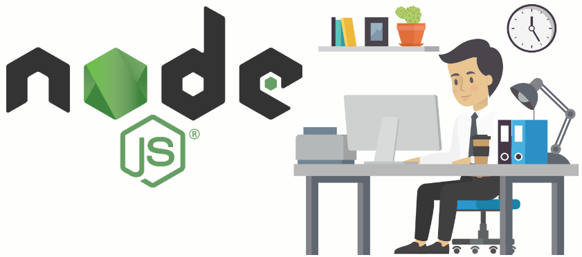

```mdx-code-block
import BrowserWindow from '@site/src/components/BrowserWindow';
import CodeBlock from '@theme/CodeBlock';
import card from '@site/src/css/markdown.module.css'
```



In this module, we will dive into the world of Node.js and get you started on your journey to becoming a proficient Node.js developer. We'll cover the basics, set up your development environment, and write your first Node.js application.

## Table of Contents

- [Table of Contents](#table-of-contents)
- [What is Node.js?](#what-is-nodejs)
  - [Why Use Node.js?](#why-use-nodejs)
- [Setting Up Node.js](#setting-up-nodejs)
  - [Installation](#installation)
  - [Verifying Installation](#verifying-installation)
- [Your First Node.js Application](#your-first-nodejs-application)

## What is Node.js?

Node.js is a runtime environment that allows you to run JavaScript on the server-side. It's built on the V8 JavaScript engine and is designed for building scalable network applications. Node.js is especially popular for building web servers and APIs.

### Why Use Node.js?

- JavaScript everywhere: Node.js allows you to use the same language (JavaScript) on both the client and server sides of web development.
- Fast and efficient: It's built on the V8 JavaScript engine, making it one of the fastest runtime environments.
- Non-blocking I/O: Node.js uses an event-driven, non-blocking I/O model, making it ideal for handling asynchronous tasks.

## Setting Up Node.js

Before you start coding in Node.js, you'll need to set up your development environment.

### Installation

1. Visit the [Node.js official website](https://nodejs.org/).
2. Download the LTS (Long-Term Support) version for stability.
3. Follow the installation instructions for your operating system.

### Verifying Installation

To make sure Node.js is installed correctly, open your terminal (or command prompt) and run the following commands:

```bash
node -v
```

<p align="center"><b>OR</b></p>

```bash
npm -v
```

You should see the installed Node.js and npm versions.

## Your First Node.js Application

Now that you have Node.js installed, let's create your first Node.js application. We'll start with a simple "Hello, Node.js!" example.

1. Create a new folder for your project and navigate to it in the terminal.

  ```bash
  mkdir my-node-app
  ```

  ```bash
  cd my-node-app
  ```

2. Create a file named `app.js` using a code editor of your choice (e.g., Visual Studio Code).

3. In `app.js`, add the following code:

   ```js title="app.js"
   // Import the built-in 'http' module
   const http = require('http');
   
   // Create an HTTP server
   const server = http.createServer((req, res) => {
     res.writeHead(200, { 'Content-Type': 'text/html' });
     res.end('Hello, Node.js!\n');
   });
   
   // Listen on port 3000
   server.listen(3000, 'localhost', () => {
     console.log('Server is running at http://localhost:3000/');
   });
   ```

This code does the following:
- Imports the built-in 'http' module.
- Creates an HTTP server that listens on port 3000.
- Responds with "Hello, Node.js!" to any incoming requests.

4. Save the file and return to the terminal. Run your Node.js application:

  ```bash
  node app.js
  ```

5. Open your web browser and visit `http://localhost:3000/`. You should see "Hello, Node.js!" displayed in your browser.

<BrowserWindow>
    <p> Hello, Node.js! </p>
</BrowserWindow>

Congratulations! You've just created your first Node.js application.

<!-- In the next module, we will explore basic JavaScript concepts for Node.js development. -->
