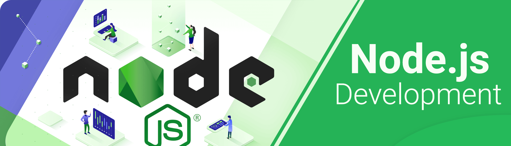

## Introduction

Welcome to the Node.js course for beginners. In this comprehensive course, you will embark on a journey to master Node.js, the powerful runtime environment for JavaScript. Whether you're completely new to programming or already have some experience, this course will equip you with the skills needed to become a proficient back-end developer.

## Node.js Mastery Course Content:

### L55: Node Session – 1
- Node.js Introduction
- EJS template engine
- Http module
- Introduction to express
- Node Handson 1

### L56: Node Session – 2
- HTTP methods: GET, POST, PUT, DELETE
- Postman
- Middleware: global and specific
- URL params and query params
- Node Handson 2

### L57: Node Session – 3
- Express routing
- Import and export modules
- Node Handson 3

### L58: Node Session – 4
- Login authentication and authorization
- Registration Process: Bcrypt hash password
- Node Handson 4

### L59: Node Session – 5
- Login: JWT token, verifying user, and comparing passwords
- Backend application deployment: Heroku
- Node Handson 5

### L60: Node Session – 6
- Project Discussion: React Blog Backend
- Node Handson 6

### Node Interview Preparation:
- Day 1
- Day 2

### HTML, CSS, JS, React, Node Mock Interview:
- Day 1
- Day 2
- Day 3

Remember to supplement each day's theoretical content with practical exercises and live coding examples to reinforce the concepts effectively. Additionally, encourage continuous learning and exploration of the Node.js ecosystem beyond the course material.