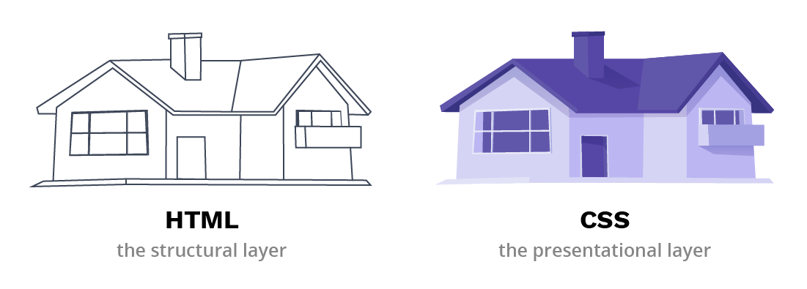
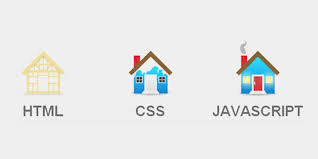

```mdx-code-block
import BrowserWindow from '@site/src/components/BrowserWindow';
import CodeBlock from '@theme/CodeBlock';
import card from '@site/src/css/markdown.module.css'
```


## HTML Introduction

HTML, which stands for HyperText Markup Language, is the backbone of every webpage on the internet. It is the standard language for creating and designing web pages and applications. Understanding HTML is the first step towards becoming a web developer or designer.

## What is HTML?

HTML is a markup language used to structure content on the web. It provides a set of elements and tags that define the various parts of a web page, such as headings, paragraphs, images, links, and more. These elements are enclosed in angle braces, like `<...>`, and they tell the browser how to display the content.

## Features of HTML

HTML offers several key features:
- It's a simple and easy-to-learn language.
- It's platform-independent and works on all devices and browsers.
- It allows for the integration of multimedia elements like images and videos.
- It supports the creation of hyperlinks for navigation.
- It can be used in conjunction with other web technologies like CSS and JavaScript to create dynamic web pages.

## Why the Term HyperText & Markup Language?

HTML is called HyperText because it allows you to create hyperlinks, which are text or images that can be clicked to navigate to other pages or resources. It's called Markup Language because you use tags to "mark up" the content, providing structure and meaning to the elements on a page.

## Tags are Meaningful Texts Enclosed in Angle Braces

Each HTML tag has a specific meaning and purpose. For example, the `<head>` tag is used to define the head section of an HTML document, which contains metadata about the page. Tags can influence the appearance, behavior, and functionality of the webpage. Understanding these tags is crucial for effective web development.

## Quick Exercise

Before we dive deeper into HTML, let's try a quick exercise. Create a simple HTML document that includes a title and a heading. Use the `<title>` and `<h1>` tags to do this. Save the document with an ".html" extension and open it in a web browser to see how it's displayed.

```html title="index.html"
<!DOCTYPE html>
<html>
<head>
    <title>My First HTML Page</title>
</head>
<body>
    <h1>Welcome to My Web Page</h1>
    <p>This is a simple HTML document.</p>
</body>
</html>
```

<BrowserWindow url="http://127.0.0.1:5500/index.html">
    <h1>Welcome to My Web Page</h1>
    <p>This is a simple HTML document.</p>
</BrowserWindow>

**let's use the analogy of building a house to understand HTML, CSS, and JavaScript:**



**HTML (Structure):** Imagine HTML as the foundation and the framework of a house. It defines the basic structure and layout of the house, just as HTML outlines the structure and content of a web page. The walls, floors, and rooms are like the HTML elements such as headings, paragraphs, lists, and images. HTML sets the foundation for everything.

**CSS (Styling):** CSS is like the interior design and decoration of the house. It deals with how the house looks and feels. In the same way, CSS styles the HTML content. Think of the paint colors, furniture, curtains, and lighting in a house. CSS controls the colors, fonts, spacing, and layout of a web page, making it visually appealing and user-friendly.

**JavaScript (Interactivity):** JavaScript is akin to the automation and functionality of a house. Imagine smart home technology that controls lighting, security systems, and appliances. JavaScript adds interactivity to a web page. It can be used for features like sliders, forms, interactive maps, and real-time updates. Just as smart technology makes a house more functional, JavaScript makes a website dynamic and responsive to user actions.



In this analogy, HTML is the structural foundation, CSS is the aesthetics and design, and JavaScript is the interactivity and functionality, just as a house combines structure, style, and functionality to create a comfortable and enjoyable living space.

## History of HTML

HTML has a rich history. It started with the earliest versions like HTML 1.0 and has evolved over time. The World Wide Web Consortium (W3C) has played a significant role in standardizing HTML. Today, we have HTML5, the latest and most powerful version of HTML. HTML5 introduced new features and elements, making it capable of handling modern web applications and multimedia content.

## Version of HTML

Here's an overview of the major versions of HTML and some important aspects of HTML:

### HTML (HyperText Markup Language)

HTML is the original markup language for creating web pages. It was first introduced in the early 1990s by **Tim Berners-Lee**, the inventor of the World Wide Web. This initial version allowed for basic text and hyperlink formatting.

### HTML 2.0

HTML 2.0 was released in 1995 and introduced features like forms, tables, and image support. It also standardized the use of HTTP for web communication.

### HTML 3.2

Released in 1997, HTML 3.2 further expanded the capabilities of web pages with the introduction of frames, which allowed multiple web pages to be displayed within a single window. It also introduced the concept of cascading style sheets (CSS) for basic styling.

### HTML 4.01

HTML 4.01, released in 1999, provided more extensive support for styles and scripting. It also included features like multimedia embedding and improved accessibility.

### XHTML (Extensible HyperText Markup Language) 1.0

XHTML 1.0, released in 2000, was an attempt to reformulate HTML as an XML-based language. It aimed to make HTML more structured and compatible with XML standards, ensuring cleaner and more consistent code.

### HTML5

HTML5, introduced in 2014, is the latest and most widely used version of HTML. It brings significant changes and improvements, including native multimedia support (audio and video), new structural elements like `<header>`, `<nav>`, and `<footer>`, as well as the canvas element for graphics rendering. HTML5 also enables interactive web applications through the use of JavaScript APIs.

## Important Aspects of HTML

1. **Structure:** HTML provides the structure for web pages by defining elements like headings, paragraphs, lists, and more. The document structure is essential for creating well-organized content.

2. **Semantic Elements:** HTML5 introduced a set of semantic elements like `<article>`, `<section>`, `<aside>`, and `<figure>` to add meaning to the content, making it more accessible and understandable by both humans and search engines.

3. **Forms:** HTML allows you to create forms for user input, including text fields, radio buttons, checkboxes, and more. It's a crucial part of web applications and data collection.

4. **Multimedia:** HTML supports multimedia elements, such as `<audio>` and `<video>`, making it possible to embed audio and video content directly into web pages.

5. **Cascading Style Sheets (CSS):** While not part of HTML itself, CSS is closely tied to it. CSS is used to style and format HTML elements, providing control over colors, fonts, layout, and more.

6. **Accessibility:** HTML includes features like alt attributes for images and ARIA (Accessible Rich Internet Applications) attributes to enhance web accessibility for individuals with disabilities.

7. **JavaScript:** HTML works in conjunction with JavaScript to create dynamic and interactive web applications. JavaScript can be used to manipulate the Document Object Model (DOM) and respond to user interactions.

8. **SEO (Search Engine Optimization):** HTML plays a critical role in SEO by allowing for the use of appropriate tags, headings, and structured data to make web content more discoverable by search engines.

These aspects are fundamental to understanding and effectively using HTML for web development. HTML's continuous evolution, along with the incorporation of modern web technologies, keeps it at the forefront of web development.

In this tutorial series, we'll cover important aspects of HTML, from the basics to advanced features, to help you become proficient in web development. Let's embark on this journey of learning and creating with HTML!