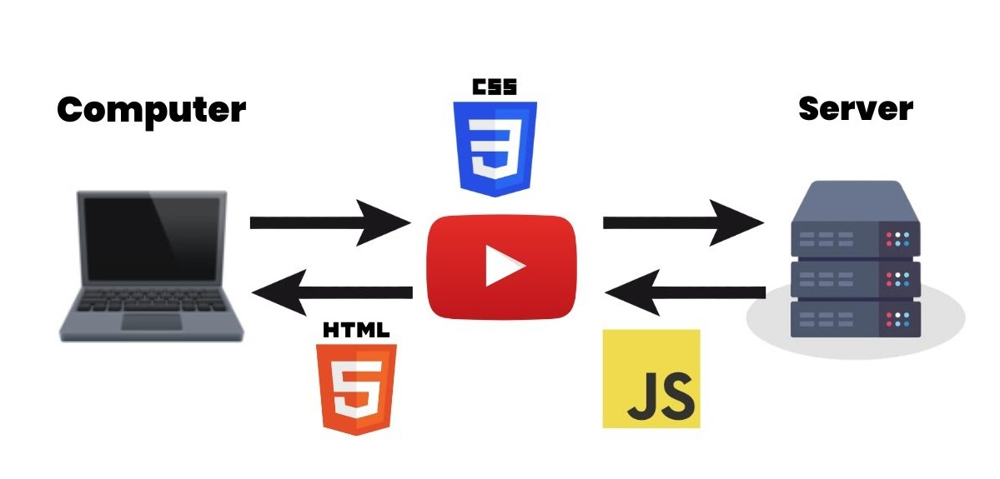
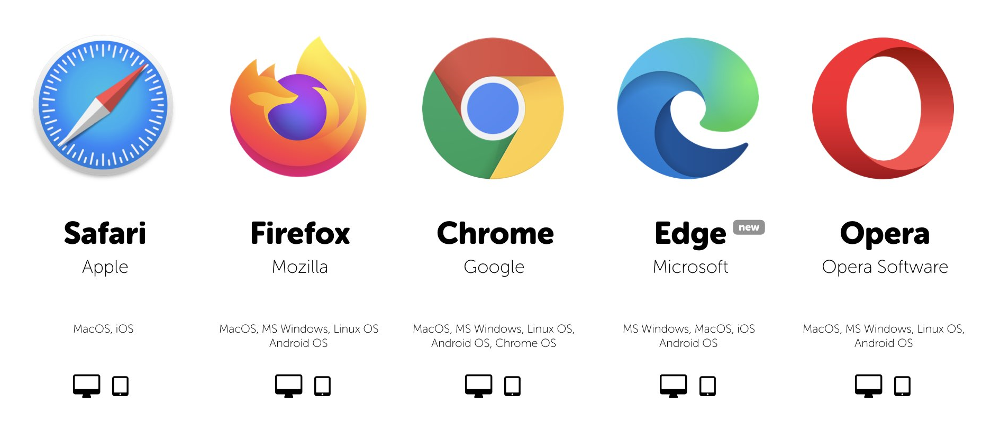

```mdx-code-block
import BrowserWindow from '@site/src/components/BrowserWindow';
import CodeBlock from '@theme/CodeBlock';
import card from '@site/src/css/markdown.module.css'
```

## HTML Working

HTML, which stands for HyperText Markup Language, is the foundation of web development. It's a markup language used to create web pages. But how does it work, and what's its role in building websites? Let's dive in.

HTML is a text-based language that uses tags to structure content on a web page. These tags, enclosed in angle brackets, tell web browsers how to display the content. For example, a `<h1>` tag indicates a top-level heading, while a `<p>` tag represents a paragraph of text.

HTML documents are plain text files that contain these tags, forming a structure for the web page. When you access a website, your web browser requests the HTML document from a web server. Once the browser receives the HTML, it interprets the tags and displays the page as you see it. In essence, HTML provides the structure and content of a web page.

## How do Websites Work?



Websites are the backbone of the internet, serving as a means to share information, provide services, and connect with people worldwide. But how do websites work, and what goes on behind the scenes?

Websites are hosted on web servers, which are powerful computers designed to store and serve web content. When you enter a website's URL (Uniform Resource Locator) in your browser, it sends a request to the web server hosting that site. The server processes this request and sends back the requested web page, often in the form of an HTML document.

Web pages are composed of HTML, which provides the structure and content of the page. However, HTML alone cannot create the interactive and visually appealing websites we see today. This is where other technologies like CSS (Cascading Style Sheets) for design and JavaScript for interactivity come into play.

## What is a Web Browser? 

A web browser is the software you use to access and view websites. It's your portal to the online world. Browsers are designed to request, retrieve, and render web pages so that you can interact with them.



Popular web browsers include Chrome, Firefox, Safari, and Edge. When you enter a URL in your browser's address bar, it sends a request to the web server hosting that site. Once the HTML document is received, the browser parses it, interprets the HTML tags, and renders the web page on your screen. The browser also manages additional resources like stylesheets and scripts, ensuring a seamless user experience.

## What is an HTML Document? 

An HTML document is the foundation of a web page. It's a text file that contains a set of HTML tags, which define the structure and content of the page. The most basic HTML document includes the essential elements like `<html>`, `<head>`, and `<body>`.

The `<html>` tag wraps the entire document, while the `<head>` section contains metadata, such as the page's title and links to external resources like stylesheets. The `<body>` section holds the visible content, including headings, paragraphs, images, and links.

HTML documents serve as instructions for web browsers, guiding them on how to display the content. Browsers interpret the tags and render the page accordingly.

## What is a Rendered Page?

A rendered page is the result of a web browser processing an HTML document. It's the web page as you see it on your screen, complete with text, images, links, and interactive elements.

When a browser receives an HTML document, it follows the instructions provided by the HTML tags to structure and display the content. This rendering process includes formatting text, positioning images, applying styles, and executing JavaScript for interactivity. The result is a visually appealing and functional web page that users can interact with.

## How does a Basic Website Work?

A basic website functions by delivering HTML documents to users' web browsers. Here's a simplified overview of the process:

1. A user enters a website's URL in their browser.
2. The browser sends a request to the web server hosting the site.
3. The server retrieves the requested HTML document.
4. The browser interprets the HTML tags and renders the web page.
5. Additional resources like stylesheets and scripts are loaded for enhanced design and interactivity.
6. The user can interact with the fully rendered web page.

This process is the fundamental principle behind the functioning of websites. As websites become more complex, additional technologies and resources are used to create dynamic and engaging user experiences.

## How does a Browser Work?

Web browsers are complex software that manage various aspects of web page rendering. They receive HTML documents, process CSS styles, execute JavaScript, and display the final web page.

When a browser receives an HTML document, it goes through several steps:
- Parsing the HTML to create a Document Object Model (DOM) representing the page's structure.
- Downloading and rendering external resources like images and stylesheets.
- Applying CSS rules to style the page.
- Executing JavaScript code for interactivity and dynamic content.

Browsers also handle user interactions, such as clicking links and submitting forms, and manage history and bookmarks.

Understanding how a browser works is essential for web developers, as it allows them to optimize websites for performance and compatibility across different browsers.
