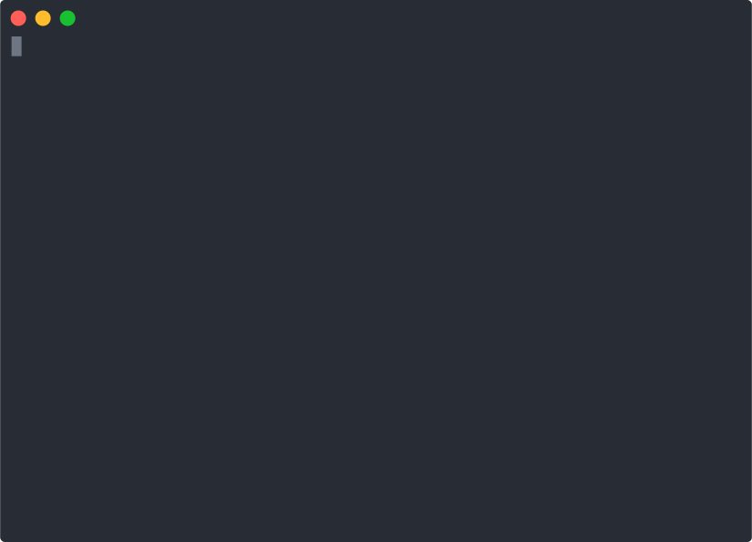

```mdx-code-block
import BrowserWindow from '@site/src/components/BrowserWindow';
import CodeBlock from '@theme/CodeBlock';
import card from '@site/src/css/markdown.module.css'
```

Create React App is an officially supported way to create single-page React applications. It provides a modern build setup with zero configuration required.

## Quick Start

To quickly get started with Create React App, follow these steps:

```sh
npx create-react-app my-app
cd my-app
npm start
```

If you have previously installed `create-react-app` globally using `npm install -g create-react-app`, we recommend uninstalling it using `npm uninstall -g create-react-app` or `yarn global remove create-react-app` to ensure that the latest version is always used.

Once the above commands have executed successfully, open [http://localhost:3000/](http://localhost:3000/) in your browser to see your app.


When you are ready to deploy your app to production, create a minified bundle using `npm run build`.



<BrowserWindow style={{backgroundColor: "#282c34"}}>
    <body >
    <div style={{textAlign: 'center'}}>
      <header style={{minHeight: '80vh', display:' flex', flexDirection: 'column', alignItems: 'center', justifyContent: 'center', fontSize: 'calc(10px + 2vmin)', color: '#fff'}}>
        
        <br/>
        <p>
          Edit <code style={{color:'#000'}}>src/App.js</code> and save to reload.
        </p> 
        <a
          style={{color: '#61dafb'}}
          href="https://reactjs.org"
          target="_blank"
          rel="noopener noreferrer"
        >
          Learn React
        </a>
      </header>
    </div>
    </body>
</BrowserWindow>

## Get Started Immediately

With Create React App, you don't need to install or configure tools like webpack or Babel. They are already preconfigured and hidden, allowing you to focus solely on writing code.

Just create a project, and you're good to go!

## Creating a New App

To create a new React app, you can choose one of the following methods based on your preferred package manager:

### Using npx

```sh
npx create-react-app@latest my-app
```

### Using npm

```sh
npm init react-app my-app
```

Make sure you have npm 6+ installed on your machine.

### Using Yarn

```sh
yarn create react-app my-app
```

Make sure you have Yarn 0.25+ installed.

## Selecting a Template

You can optionally start a new app from a template by appending `--template [template-name]` to the creation command. If no template is selected, your project will be created with the base template.

Templates are named in the format `cra-template-[template-name]`. You only need to provide the `[template-name]` to the creation command.

For example:

```sh
npx create-react-app my-app --template [template-name]
```

You can find a list of available templates by searching for ["cra-template-\*"](https://www.npmjs.com/search?q=cra-template-*) on npm.

To build your own template, refer to our `Custom Templates` documentation.

### Creating a TypeScript App

To start a new TypeScript app, append `--template typescript` to the creation command:

```sh
npx create-react-app my-app --template typescript
```

If you already have a project and want to add TypeScript, check out our [Adding TypeScript](./adding-typescript) documentation.

## Selecting a Package Manager

When creating a new app, the CLI will use either npm or Yarn to install dependencies, depending on the tool you use to run `create-react-app`.

For npm:

```sh
npx create-react-app my-app
```

For Yarn:

```sh
yarn create react-app my-app
```

## Project Structure

Running the above commands will create a directory named `my-app` in the current folder. Inside this directory, the initial project structure and necessary dependencies will be generated:

```
my-app
├── README.md
├── node_modules
├── package.json
├── .gitignore
├── public
│   ├── favicon.ico
│   ├── index.html
│   ├── logo192.png
│   ├── logo512.png
│   ├── manifest.json
│   └── robots.txt
└── src
    ├── App.css
    ├── App.js
    ├── App.test.js
    ├── index.css
    ├── index.js
    ├── logo.svg
    ├── serviceWorker.js
    └── setupTests.js
```

No configuration or complex folder structures are required. You will find only the files necessary to build your app. Once the installation is complete, navigate to your project folder:

```sh
cd my-app
```

## Available Scripts

Inside the project folder, you can run the following built-in commands:

### `npm start` or `yarn start`

Runs the app in development mode. Open [http://localhost:3000](http://localhost:3000) in your browser to view it.

<BrowserWindow style={{backgroundColor: "#282c34"}}>
    <body >
    <div style={{textAlign: 'center'}}>
      <header style={{minHeight: '80vh', display:' flex', flexDirection: 'column', alignItems: 'center', justifyContent: 'center', fontSize: 'calc(10px + 2vmin)', color: '#fff'}}>
        
        <br/>
        <p>
          Edit <code style={{color:'#000'}}>src/App.js</code> and save to reload.
        </p> 
        <a
          style={{color: '#61dafb'}}
          href="https://reactjs.org"
          target="_blank"
          rel="noopener noreferrer"
        >
          Learn React
        </a>
      </header>
    </div>
    </body>
</BrowserWindow>

The page will automatically reload if you make changes to the code. Any build errors or lint warnings will be displayed in the console.

### `npm test` or `yarn test`

Runs the test watcher in interactive mode. By default, it runs tests related to files changed since the last commit. Refer to our `Running Tests`` documentation for more details.

### `npm run build` or `yarn build`

Builds the app for production in the `build` folder. It bundles React in production mode and optimizes the build for better performance.

The build output is minified, and the filenames include hashes for caching.

Your app is now ready to be deployed!